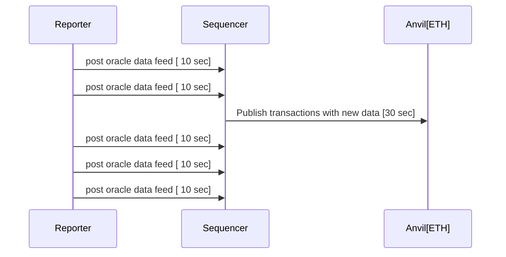

# Repository for Encode London 25-27 Oct Hackaton

## Table of Contents

   * [Running an available Oracle Script](#running-an-available-oracle-script)
      * [Run wasm revolut reporter](#run-wasm-revolut-reporter)
      * [Run wasm yahoo reporter](#run-wasm-yahoo-reporter)
      * [Using a similar approach you can use CoinMarketCap wasm reporter](#using-a-similar-approach-you-can-use-coinmarketcap-wasm-reporter)
      * [An oracle script that reports text](#an-oracle-script-that-reports-text)
   * [Reading on-chain data](#reading-on-chain-data)
      * [Using cast](#using-cast)
      * [Using check_oracle_data.sh](#using-check_oracle_datash)
      * [Using ethers.js](#using-ethersjs)
      * [Using solidity](#using-solidity)
   * [Creating your own new Oracle Script](#creating-your-own-new-oracle-script)

Welcome to Encode London 25-27 Oct Hackaton. To participate in hackaton you need to setup blocksense network in your local machine.

Install git, [docker compose](https://docs.docker.com/compose/install/) & [rust](https://www.rust-lang.org/tools/install). Currently we only support rust for writing oracle scripts. It's technologically possible to use other languages, but this is out of the scope for this hackaton because our SDK is only available for rust. So you need to get rusty!
Your first goal is to run one of our oracle script to verify all services are running and set up correctly.

1. Clone this repository:

   ```bash
   git clone git@github.com:blocksense-network/EncodeLondon_Hackathon.git
   ```

   or

   ```bash
   git clone https://github.com/blocksense-network/EncodeLondon_Hackathon.git
   ```

> [!IMPORTANT]
> For Mac users you need to switch to `mac_images` branch. All the instructions apply for Mac & Linux.

2. Then download out pre-build images with following command

   ```bash
   docker compose pull
   ```

3. Make sure you have rust compiler with wasm32-wasi target:

   ```bash
   cargo -V
   rustup target add wasm32-wasi
   ```

## Running an available Oracle Script

### Run wasm revolut reporter

To run wasm revolut reporter you need to build it:

```bash
cd examples/revolut && cargo update && cargo build --target wasm32-wasi --release
```

Now go to root directory of this repository and start all the containers:

```bash
docker compose up
```

This will launch a local ETH blockchain (anvil), blocksense sequencer service which is responsible for publishing oracle scripts data feeds to the ETH blockchain and a reporter which will execute your oracle script and push its data feed to sequencer.



The system is designed to handle many decentralized oracles, but for this hackaton we will use only one reporter that executes one oracle script.
If everything works correctly you will have one oracle script that reports one price feed. In the docker compose output you can see something like:

```log
sequencer-1   | 2024-10-15T14:57:08.291818Z DEBUG sequencer::http_handlers::data_feeds: Recvd result from reporter[0]: Numerical(64680.51629596154)
sequencer-1   | 2024-10-15T14:57:08.291843Z DEBUG sequencer::http_handlers::data_feeds: getting feed_id = 31
sequencer-1   | 2024-10-15T14:57:08.291861Z DEBUG feed_registry::types: Accepted report!
```

---

### Run wasm yahoo reporter

Next step is to change the oracle script in the reporter with more sophisticated one. Which uses Yahoo finance with your private API key

Register at [Yahoo finance API](https://financeapi.net/dashboard) and paste the API key in this directory in file:

`examples/yahoo/spin.toml` in section:

```toml
[[trigger.oracle.capabilities]]
data = "xxxxxxxxxxxxxxxxxxxxxxxxxxxxxxxxxxxxxxxx"
id = "YAHOO_API_KEY"
```

Now build the yahoo reporter:

```bash
cd examples/yahoo && cargo update && cargo build --target wasm32-wasi --release
```

Go to the main directory in the repository and enable yahoo entrypoint of the `reporter` service in `docker-compose.yml`

```yaml
entrypoint:
  ["/bin/sh", "-c", "cd /usr/local/blocksense/oracles/yahoo && /spin up"]
```

Start docker compose again. That will start an anvil instance, one sequencer and a yahoo reporter

```bash
  docker compose down # if you have already running containers
  docker compose up
```

If everything is setup correctly you will see anvil reporting published transactions:

```bash
  docker compose logs anvil
```

```log

anvil-1 | Genesis Timestamp
anvil-1 | ==================
anvil-1 |
anvil-1 | 1728549718
anvil-1 |
anvil-1 | Listening on 0.0.0.0:8545
anvil-1 | eth_blockNumber
anvil-1 | eth_getCode
anvil-1 | eth_gasPrice
anvil-1 | eth_chainId
anvil-1 | eth_getTransactionCount
anvil-1 | eth_sendRawTransaction
anvil-1 |
anvil-1 | Transaction: 0x92befeefef33dc231e696f65a69502609452f2179fb1a5e9c95842081ab4c5d1
anvil-1 | Gas used: 21328
anvil-1 |
anvil-1 | Block Number: 1
anvil-1 | Block Hash: 0x0d2ebeea50b02beebfbe50a310871773fa186da61a386bb9dcb2d3df97a4bb5a
anvil-1 | eth_blockNumber
anvil-1 | Block Time: "Thu, 10 Oct 2024 08:42:30 +0000"
anvil-1 |
anvil-1 | eth_getBlockByNumber
anvil-1 | eth_getTransactionReceipt
anvil-1 | eth_blockNumber
anvil-1 | eth_blockNumber
anvil-1 | eth_blockNumber
anvil-1 | eth_blockNumber
anvil-1 | eth_gasPrice
anvil-1 | eth_chainId
anvil-1 | eth_sendRawTransaction
anvil-1 |
anvil-1 | Transaction: 0x5fac5e16d81fab79649b9d80752305eede9b718ba54cb6e1433372429088f1c9
anvil-1 | Gas used: 21316
anvil-1 |
anvil-1 | Block Number: 2
anvil-1 | Block Hash: 0xd95ca48a9c898f93a4f15b5d7321f7f82de9928e3f3f6f44caab4b33bd9d9fa7
anvil-1 | Block Time: "Thu, 10 Oct 2024 08:43:00 +0000"
anvil-1 |
```

### Using a similar approach you can use CoinMarketCap wasm reporter

Add CoinMarketCap key from this registration

Register at https://coinmarketcap.com/api/pricing/ and paste API key in this directory in file

`examples/cmc/spin.toml` in section:

```toml
[[trigger.oracle.capabilities]]
data = "00000000-0000-0000-0000-000000000000"
id = "CMC_API_KEY"
```

Now build the cmc reporter:

```bash
cd examples/cmc && cargo update && cargo build --target wasm32-wasi --release
```

Again at the `reporter` service in `docker-compose.yml` enable the cmc entrypoint

```yaml
entrypoint:
  ["/bin/sh", "-c", "cd /usr/local/blocksense/oracles/cmc && /spin up"]
```

You can now start docker compose again.

```bash
  docker compose down # if you have already running containers
  docker compose up
```

If everything is setup correctly you will see anvil reporting published transactions.

### An oracle script that reports text

There is the possibility for the oracle script to write string data. To see an example in action, build the `string_oracle` project the same way as the others.

```bash
cd examples/string_oracle && cargo update && cargo build --target wasm32-wasi --release
```

Now, you can change `docker-compose.yaml` to switch to the string oracle like you did before for the others, and a string will be reported on feed id 222, alongside the price feeds from the previous examples (see the source code).

## Reading on-chain data

Once having all set up and running you can read the data from the blockchain.
For more information of how our Smart Contracts work navigate to the [Blocksense Smart Contract Documentation](https://docs.blocksense.network/docs/contracts)

There is a couple of ways to read the data from the blockchain. As mentioned above, we have anvil instances running, which are local Ethereum blockchains. We deploy our smart contracts on these blockchains and we can interact with them using different tools.

### Using `cast`

One approach could be to use the `cast` tool. `cast` is a command line tool that allows you to interact with the blockchain. You can find more information about it [here](https://book.getfoundry.sh/cast/).

Here is an example of how to use `cast` to read the data from the blockchain:

```bash
cast call 0xc04b335A75C5Fa14246152178f6834E3eBc2DC7C --data 0x8000001f --rpc-url http://127.0.0.1:8545 |  cut -c1-50 | cast to-dec
```

Lets break down the command:

1. We make a call to the contract with address `0xc04b335A75C5Fa14246152178f6834E3eBc2DC7C`. This is our [UpgradeableProxy](https://docs.blocksense.network/docs/contracts/reference-documentation/UpgradeableProxy) contract.

2. We pass the data `0x8000001f` to the contract. This way you interact with the `fallback` function of the `UpgradeableProxy` contract. More info on this can be found [here](https://docs.blocksense.network/docs/contracts#call-handling-mechanism). This call allows us to read the latest price and timestamp. One question you might have at this point is how to craft this selector. In one handy way is to use `node repl` or `js` as follows:

```javascript
const id = 31;
const selector = "0x" + ((id | 0x80000000) >>> 0).toString(16).padStart(8, "0");
console.log(selector);
// '0x8000001f'
```

Note that the `id` is the id of the data feed you want to read data for. In this case with id 31 we are reading the price of `BTC/USD` data feed. You can confirm that by navigating to `config/feed_config.json` file or in the `spin.toml` file of any oracle script.

3. We pass the `rpc-url` of the anvil instance we want to interact with. In this case we are using the first anvil instance.

4. We pipe the output to `cut` to get only the first 50 characters of the output. This is because they refer to the price itself. The output is in hex format and we want to convert it to decimal. We can do that by piping the output to `cast to-dec`.

Expected result must be something like `67260166034648270000000` which is the price of BTC/USD in the moment of the call.

> Note: Potential issues
>
> - If the result is 0 that means the reporter is not running correctly.
> - If you receive an error that could be due to the fact that the smart contract is not deployed on the blockchain.

### Using check_oracle_data.sh

We also provide a handy `check_oracle_data.sh` with invokes the cast inside the running docker container of anvil. Feel free to copy/edit this script accouring to your needs.

```
$ ./check_oracle_data.sh 
UpgradeableProxy contract address 0xc04b335A75C5Fa14246152178f6834E3eBc2DC7C
Anvil container id 61f12227a79a
BTC/USD Price from contract
66327.8

ETH/USD Price from contract
2516.29

EUR/USD Price from contract
1.07646

Raw bytes from contract
0x48656c6c6f20617765736f6d6520426c6f636b636861696e


Text from contract
Hello awesome Blockchain
```

### Using `ethers.js`

We have examples for interacting with `UpgradeableProxy` contract using `ethers.js` [here](https://docs.blocksense.network/docs/contracts/integration-guide/using-data-feeds/historic-data-feed#ethersjs-v6x).

### Using `solidity`

We have examples for interacting with `UpgradeableProxy` contract using `solidity` [here](https://docs.blocksense.network/docs/contracts/integration-guide/using-data-feeds/historic-data-feed#solidity).

Here is a step-by-step guide, anyway. It uses `foundry`. It assumes that you have not changed the repo and are still running the revolut example.

**step 1.** Create a new `foundry` project in a directory that is not inside a git repo:

```
forge init touch-bsn && cd touch-bsn
```

**step 2.** Write a contract that calls the BlockSense Network
[HistoricalDataFeed](https://docs.blocksense.network/docs/contracts/integration-guide/using-data-feeds/historic-data-feed).
As mentioned in the documentation, the contract that is really called is
`UpgradeableProxy`. For more details follow the link.

```
cat > src/UpgradeableProxyConsumer.sol
```

Paste the following:

```solidity
// SPDX-License-Identifier: MIT
pragma solidity ^0.8.24;

import {ProxyCall} from "lib/ProxyCall.sol";

/**
 * THIS IS AN EXAMPLE CONTRACT THAT USES UN-AUDITED CODE.
 * DO NOT USE THIS CODE IN PRODUCTION.
 */
contract UpgradeableProxyConsumer {
    address public immutable dataFeedStore;

    constructor(address feedAddress) {
        dataFeedStore = feedAddress;
    }

    function getDataById(uint32 key) external view returns (uint256 value, uint64 timestamp) {
        bytes32 data = ProxyCall._callDataFeed(dataFeedStore, abi.encodePacked(0x80000000 | key));

        return (uint256(uint192(bytes24(data))), uint64(uint256(data)));
    }

    function getFeedAtCounter(uint32 key, uint32 counter) external view returns (uint256 value, uint64 timestamp) {
        bytes32 data = ProxyCall._callDataFeed(dataFeedStore, abi.encodeWithSelector(bytes4(0x20000000 | key), counter));

        return (uint256(uint192(bytes24(data))), uint64(uint256(data)));
    }

    function getLatestCounter(uint32 key) external view returns (uint32 counter) {
        return uint32(ProxyCall._latestRound(key, dataFeedStore));
    }

    function getLatestRoundData(uint32 key) external view returns (int256 value, uint256 timestamp, uint80 counter) {
        (counter, value, timestamp,,) = ProxyCall._latestRoundData(key, dataFeedStore);
    }
}
```

Make sure to press <Ctrl/Cmd+D> to finish the paste.

**libraries**

For this to work, you would also need this library file:

```
cat > lib/ProxyCall.sol
```

Paste the following:

```solidity
// SPDX-License-Identifier: MIT
pragma solidity ^0.8.24;

/// @title ProxyCall
/// @notice Library for calling dataFeedStore functions
/// @dev Contains utility functions for calling gas efficiently dataFeedStore functions and decoding return data
library ProxyCall {
  /// @notice Gets the latest answer from the dataFeedStore
  /// @param key The key ID for the feed
  /// @param dataFeedStore The address of the dataFeedStore contract
  /// @return answer The latest stored value after being decoded
  function _latestAnswer(
    uint32 key,
    address dataFeedStore
  ) internal view returns (int256) {
    return
      int256(
        uint256(
          uint192(
            bytes24(
              _callDataFeed(dataFeedStore, abi.encodePacked(0x80000000 | key))
            )
          )
        )
      );
  }

  /// @notice Gets the round data from the dataFeedStore
  /// @param _roundId The round ID to retrieve data for
  /// @param key The key ID for the feed
  /// @param dataFeedStore The address of the dataFeedStore contract
  /// @return roundId The round ID
  /// @return answer The value stored for the feed at the given round ID
  /// @return startedAt The timestamp when the value was stored
  /// @return updatedAt Same as startedAt
  /// @return answeredInRound Same as roundId
  function _getRoundData(
    uint80 _roundId,
    uint32 key,
    address dataFeedStore
  )
    internal
    view
    returns (uint80, int256 answer, uint256 startedAt, uint256, uint80)
  {
    (answer, startedAt) = _decodeData(
      _callDataFeed(
        dataFeedStore,
        abi.encodeWithSelector(bytes4(0x20000000 | key), _roundId)
      )
    );

    return (_roundId, answer, startedAt, startedAt, _roundId);
  }

  /// @notice Gets the latest round ID for a given feed from the dataFeedStore
  /// @dev Using assembly achieves lower gas costs
  /// @param key The key ID for the feed
  /// @param dataFeedStore The address of the dataFeedStore contract
  /// @return roundId The latest round ID
  function _latestRound(
    uint32 key,
    address dataFeedStore
  ) internal view returns (uint256 roundId) {
    // using assembly staticcall costs less gas than using a view function
    assembly {
      // get free memory pointer
      let ptr := mload(0x40)

      // store selector in memory at location 0
      mstore(0, shl(224, or(0x40000000, key)))

      // call dataFeedStore with selector 0xc0000000 | key (4 bytes) and store return value (64 bytes) at memory location ptr
      let success := staticcall(gas(), dataFeedStore, 0, 4, ptr, 64)

      // revert if call failed
      if iszero(success) {
        revert(0, 0)
      }

      // load return value from memory at location ptr
      // roundId is stored in the second 32 bytes of the return 64 bytes
      roundId := mload(add(ptr, 32))
    }
  }

  /// @notice Gets the latest round data for a given feed from the dataFeedStore
  /// @dev Using assembly achieves lower gas costs
  /// @param key The key ID for the feed
  /// @param dataFeedStore The address of the dataFeedStore contract
  /// @return roundId The latest round ID
  /// @return answer The latest stored value after being decoded
  /// @return startedAt The timestamp when the value was stored
  /// @return updatedAt Same as startedAt
  /// @return answeredInRound Same as roundId
  function _latestRoundData(
    uint32 key,
    address dataFeedStore
  )
    internal
    view
    returns (uint80 roundId, int256 answer, uint256 startedAt, uint256, uint80)
  {
    bytes32 returnData;

    // using assembly staticcall costs less gas than using a view function
    assembly {
      // get free memory pointer
      let ptr := mload(0x40)

      // store selector in memory at location 0
      mstore(0x00, shl(224, or(0xc0000000, key)))

      // call dataFeedStore with selector 0xc0000000 | key (4 bytes) and store return value (64 bytes) at memory location ptr
      let success := staticcall(gas(), dataFeedStore, 0x00, 4, ptr, 64)

      // revert if call failed
      if iszero(success) {
        revert(0, 0)
      }

      // assign return value to returnData
      returnData := mload(ptr)

      // load return value from memory at location ptr
      // roundId is stored in the second 32 bytes of the return 64 bytes
      roundId := mload(add(ptr, 32))
    }

    (answer, startedAt) = _decodeData(returnData);

    return (roundId, answer, startedAt, startedAt, roundId);
  }

  /// @notice Calls the dataFeedStore with the given data
  /// @dev Using assembly achieves lower gas costs
  /// Used as a call() function to dataFeedStore
  /// @param dataFeedStore The address of the dataFeedStore contract
  /// @param data The data to call the dataFeedStore with
  /// @return returnData The return value from the dataFeedStore
  function _callDataFeed(
    address dataFeedStore,
    bytes memory data
  ) internal view returns (bytes32 returnData) {
    // using assembly staticcall costs less gas than using a view function
    assembly {
      // get free memory pointer
      let ptr := mload(0x40)

      // call dataFeedStore with data and store return value (32 bytes) at memory location ptr
      let success := staticcall(
        gas(), // gas remaining
        dataFeedStore, // address to call
        add(data, 32), // location of data to call (skip first 32 bytes of data which is the length of data)
        mload(data), // size of data to call
        ptr, // where to store the return data
        32 // how much data to store
      )

      // revert if call failed
      if iszero(success) {
        revert(0, 0)
      }

      // assign loaded return value at memory location ptr to returnData
      returnData := mload(ptr)
    }
  }

  /// @notice Decodes the return data from the dataFeedStore
  /// @param data The data to decode
  /// @return answer The value stored for the feed at the given round ID
  /// @return timestamp The timestamp when the value was stored
  function _decodeData(bytes32 data) internal pure returns (int256, uint256) {
    return (int256(uint256(uint192(bytes24(data)))), uint64(uint256(data)));
  }
}
```

Make sure to press <Ctrl/Cmd+D> to finish the paste.

**step 3.** Build your smart contract:

```
forge build
```

This should work and the output should looks something like this:

```
[⠊] Compiling...
[⠃] Installing Solc version 0.8.24
[⠊] Successfully installed Solc 0.8.24
[⠃] Installing Solc version 0.8.24
[⠊] Successfully installed Solc 0.8.24
[⠃] Compiling 31 files with 0.8.24
[⠒] Solc 0.8.24 finished in 1.84s
Compiler run successful!
```

**step 4.** Register your smart contract:

Before you can register your smart contract, you need to have a place to register it to. Run the sandbox environment and inspect the output:

```
docker compose up
```

The anvil logs contain a list of private keys. Pick the seventh one, because seven is your lucky number (PRIVATE_KEY_FROM_ANVIL).

```
anvil-a-1     | Private Keys
anvil-a-1     | ==================
anvil-a-1     |
anvil-a-1     | (0) 0xac0974bec39a17e36ba4a6b4d238ff944bacb478cbed5efcae784d7bf4f2ff80
anvil-a-1     | (1) 0x59c6995e998f97a5a0044966f0945389dc9e86dae88c7a8412f4603b6b78690d
anvil-a-1     | (2) 0x5de4111afa1a4b94908f83103eb1f1706367c2e68ca870fc3fb9a804cdab365a
anvil-a-1     | (3) 0x7c852118294e51e653712a81e05800f419141751be58f605c371e15141b007a6
anvil-a-1     | (4) 0x47e179ec197488593b187f80a00eb0da91f1b9d0b13f8733639f19c30a34926a
anvil-a-1     | (5) 0x8b3a350cf5c34c9194ca85829a2df0ec3153be0318b5e2d3348e872092edffba
anvil-a-1     | (6) 0x92db14e403b83dfe3df233f83dfa3a0d7096f21ca9b0d6d6b8d88b2b4ec1564e
anvil-a-1     | (7) 0x4bbbf85ce3377467afe5d46f804f221813b2bb87f24d81f60f1fcdbf7cbf4356 # PRIVATE_KEY_FROM_ANVIL
anvil-a-1     | (8) 0xdbda1821b80551c9d65939329250298aa3472ba22feea921c0cf5d620ea67b97
anvil-a-1     | (9) 0x2a871d0798f97d79848a013d4936a73bf4cc922c825d33c1cf7073dff6d409c6
```

Also, inspect the logs and look for the address at which `scdeploy` deploys FeedRegistry (ADDRESS_OF_UPGRADEABLE_PROXY). The text looks something like this:

```
scdeploy-a-1  | Predicted address for 'UpgradeableProxy':  0xc04b335A75C5Fa14246152178f6834E3eBc2DC7C # ADDRESS_OF_UPGRADEABLE_PROXY
```

Now, take these two addresses and plug them in the correct places for the `forge create` command:

```
forge create --rpc-url http://0.0.0.0:8545 --private-key <PRIVATE_KEY_FROM_ANVIL> src/UpgradeableProxyConsumer.sol:UpgradeableProxyConsumer --constructor-args <ADDRESS_OF_UPGRADEABLE_PROXY>
```

Your smart contract should now be registered! You are given the address where it lives:

```
[⠊] Compiling...
[⠒] Installing Solc version 0.8.24
[⠘] Successfully installed Solc 0.8.24
No files changed, compilation skipped
Deployer: 0x14dC79964da2C08b23698B3D3cc7Ca32193d9955
Deployed to: 0x81911707ED6aAe1fD5ee010dA4159c08fE4E850B # MY_CONTRACT_ADDRESS
Transaction hash: 0xd4edced4e4333b3ff3432807e30b9c6205f52c1e7e5e0da31d37508551ad796e
```

**step 5.** Call your smart contract:

Use `cast call` to call your smart contract:

```
cast call <MY_CONTRACT_ADDRESS> "getLatestRoundData(uint32)(int256,uint256,uint80)" 31 --rpc-url http://0.0.0.0:8545
```

31 is the id of the BTC/USD feed, as can be seen in `config/feeds_config.json`.

You should now see latest round data for the BTC/USD pair stored in your
Blocksense Network sandbox setup! It should look something like this:

```
$ cast call 0x81911707ED6aAe1fD5ee010dA4159c08fE4E850B "getLatestRoundData(uint32)(int256,uint256,uint80)" 31 --rpc-url http://0.0.0.0:8545
66530468584445830000000 [6.653e22]
1729595483 [1.729e9]
42
```

In this output, the first number is the price, the second one is the timestamp,
and the third one is the number of iterations (slots) of the sequencer in your
local sandbox.

If you'd like to see an example of how to call the `FeedRegistry` smart
contract instead, see
[SmartContract-Using-FeedRegistry.md](SmartContract-Using-FeedRegistry.md).

## Creating your own new Oracle Script

This is the main task of this hackaton - to create your oracle script, feed data to the blockchain and do something interesting or useful with it. To achieve your goal we suggest to use copy-paste-edit strategy with one of our existing oracles.

For example:

```bash
cd examples && cp -r revolut my_oracle
```

edit `my_oracle/spin.toml`:

```toml
spin_manifest_version = 2

[application]
authors = ["Your Names"]
name = "Blocksense Oracle Hackathon"
version = "0.1.0"

[application.trigger.settings]
interval_time_in_seconds = 10 # reporting interval in seconds. Adjust if necessary
sequencer = "http://sequencer:8877/post_report"
secret_key = "536d1f9d97166eba5ff0efb8cc8dbeb856fb13d2d126ed1efc761e9955014003"
reporter_id = 0

[[trigger.oracle]]
component = "your-awesome-script"

[[trigger.oracle.data_feeds]]
id = "47" #UPDATE DATA FEEDS IF NEEDED
data = "ETHUSD"

[[trigger.oracle.data_feeds]]
id = "31"
data = "BTCUSD"

[[trigger.oracle.data_feeds]]
id = "253"
data = "EURUSD"


[component.your-awesome-script]
source = "target/wasm32-wasi/release/my_awesome_oracle.wasm"
allowed_outbound_hosts = ["https://www.awesome-data-feed.com"]
[component.your-awesome-script.build]
command = "cargo build --target wasm32-wasi --release"
```

Edit `my_oracle/Cargo.toml`:

```toml
[package]
name = "my-awesome-oracle"
authors = ["Your name"]
description = ""
version = "0.1.0"
edition = "2021"

[lib]
crate-type = ["cdylib"]

[dependencies]
wit-bindgen = "0.16.0"
blocksense-sdk = { git = "https://github.com/blocksense-network/sdk.git" }
anyhow = "1.0.82"
serde_json = "1.0"
url = "2.5"
serde = { version = "1.0", features = ["derive"] }

# Add extra dependencies here, if needed

```

If you need a new data feed for your application you can appended to
`config/feed_config.json`

```json
    {
      "id": 42, # Pick some ID that is not occupied, or you can reuse existing one ( but let it be between 0 and 257 )
      "name": "MyToken",
      "fullName": "",
      "description": "MyToken / USD",
      "decimals": 8,
      "report_interval_ms": 30000,
      "quorum_percentage": 1, # Leave unchannged
      "type": "Crypto",
      "script": "CoinMarketCap",
      "pair": {
        "base": "MyToken",
        "quote": "USD"
      },
      "first_report_start_time": {
        "secs_since_epoch": 0,
        "nanos_since_epoch": 0
      },
      "resources": {
        "cmc_id": 123456,
        "cmc_quote": "MyToken"
      }
    },
```

Write the code for your oracle and build it.

Edit `docker-compose.yaml` to start your oracle script:

```yaml
  reporter:
    image: ymadzhunkov/blocksense_hackaton:reporter
    networks:
      - backend
    volumes:
      - ./examples/yahoo:/usr/local/blocksense/oracles/yahoo
      - ./examples/revolut:/usr/local/blocksense/oracles/revolut
      - ./examples/cmc:/usr/local/blocksense/oracles/cmc
      - ./examples/my_oracle:/usr/local/blocksense/oracles/my_oracle
entrypoint: ['/bin/sh', '-c', 'cd /usr/local/blocksense/oracles/my_oracle && /spin up']
    depends_on:
      sequencer:
        condition: service_healthy
```

Restart the entire setup:

```bash
cd examples/my_oracle && cargo update && cargo build --target wasm32-wasi --release
docker compose down
docker compose up
```
